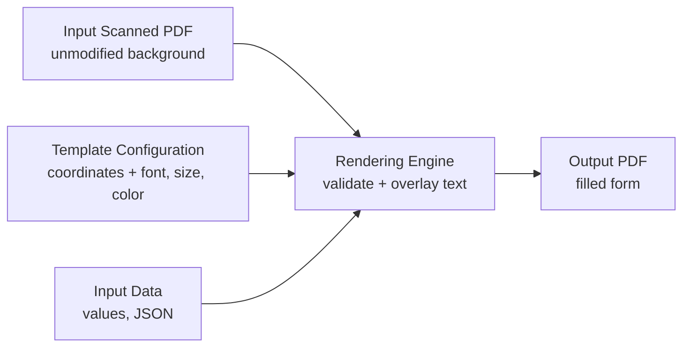

# 03 - Architecture

> The architecture of the PDF Population Engine: the end-to-end flow, what each component is responsible for, and how the concepts map to the actual modules.

## High-Level Flow

The engine takes the original scanned PDF as a fixed background and draws the customer values on top of it at pre-defined positions.

## Components

- **Input Scanned PDF** — the original image-based form. It is the base layer and is **never modified**; it only serves as the background the text is drawn over.
- **Template Configuration** — for each field, *where* and *how* to draw it: the `(x, y)` coordinates plus font, font size, and color. Stored as external JSON, not in code.
- **Input Data** — the actual values to place (e.g., name, account number), supplied as structured JSON, separate from the template.
- **Rendering Engine** — the component that combines the three inputs: it reads each field from the data, looks up its position and style in the template config, and **overlays** the value onto the scanned page. It produces the final document without altering the underlying scan.
- **Output PDF** — the original scanned form with the values visually placed on top.

## Rendering Model

A PDF page behaves like a **canvas**, and rendering means **drawing objects onto that canvas**. To draw a piece of text, the engine needs four things:

- **Coordinates** — the `(x, y)` position on the page.
- **Font** — the typeface to use.
- **Font size** — how large the text is.
- **Color** — the text color.

Crucially, the scanned image is **not edited**. The engine adds a new text layer *on top of* the existing page — an overlay — so the original document stays intact and the values sit exactly where the configuration says.

## Why Coordinates Live in Configuration, Not Code

Positions are **data, not logic**. Storing them in external config means a form can be adjusted, or a brand-new form supported, by editing (or adding) a config file — with no change to the rendering engine. The engine stays generic; the config carries everything template-specific. (Rationale recorded in `07-Engineering-Decisions.md`.)

## Adding a New Template

Because the engine is driven entirely by configuration, supporting a new form does not require changing application logic:

1. Add a new template configuration file describing that form's fields and their positions/styles.
2. Provide input data for those fields.

The same rendering engine then handles it unchanged.

## How the Components Map to Modules

| Concept | Module / file | Notes |
|---|---|---|
| Page rendering (for calibration) | `src/pdf_to_images.py` | PDF pages → `output/<template>/pageN.png` at a fixed DPI |
| Calibration (one-time, per template) | `src/coordinate_calibrator.py` | Click each field → `config/mappings/<template>.json` in PDF points |
| Template configuration | `config/fields.json` + `config/mappings/<template>.json` | Field list/pages are authored; the mapping is generated |
| Rendering engine | `src/pdf_renderer.py` | Validates the three inputs, overlays values, writes the filled PDF |
| Central settings | `src/settings.py` | Single source of truth (input PDF, data file, DPI, style); paths derived from the template name |

Calibration is a developer-side, one-time step — production runs only need the renderer plus the config files.

## Future Architecture Extensions (High Level)

The rendering step is intentionally decoupled from *how positions are determined*. That leaves room to later swap or augment the fixed-coordinate source with an **OCR-based** positioning step for variable or lower-quality scans — without redesigning the rest of the pipeline. (Captured as future work in `05-Performance-And-Limitations.md`.)
